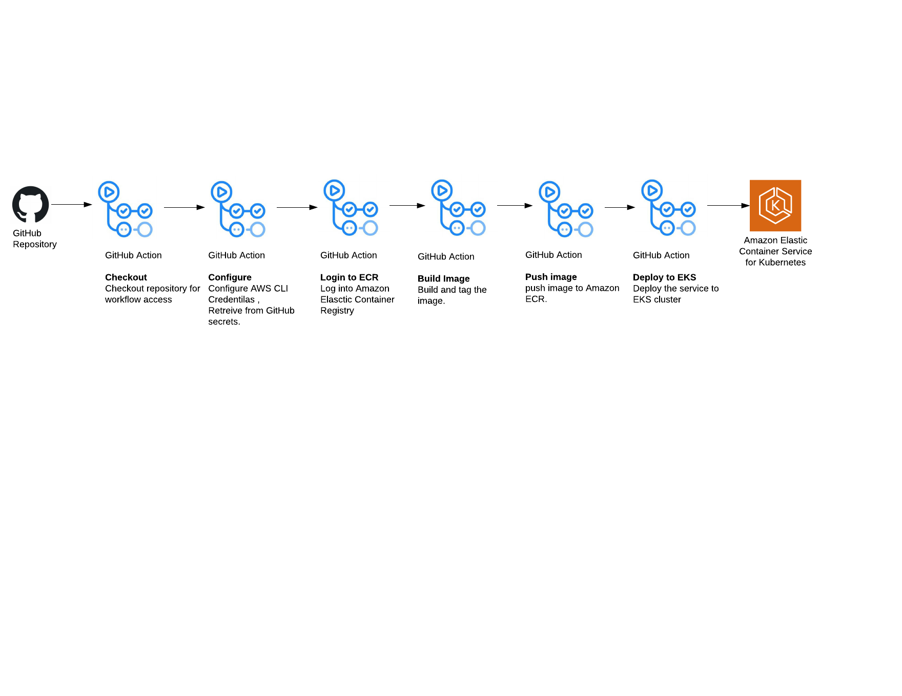

# Full CI/CD for Nodejs service

GitHub Action multi-environment CI/CD pipeline triggerd by push to any branch:
- Build,tag and push new docker image of the service to Amazon ECR
- Deploy latest docker image service to EKS cluster of the specific environment



### Built With

* [NodeJS](https://nodejs.org/)
* [Docker](https://www.docker.com/)
* [Kubernetes](https://kubernetes.io/)
* [Terraform](https://www.terraform.io/)
* [GitHub Actions](https://github.com/features/actions/)

# Getting Started

## Prerequisites

1. Install terraform in /usr/bin directory
2. An AWS account with the IAM permissions listed on the [EKS module documentation](https://github.com/terraform-aws-modules/terraform-aws-eks/blob/master/docs/iam-permissions.md)
3. kubectl
4. Docker
5. ECR repository with relevant permissions to the AWS user

## Installation

### Clone repo and configure

1. Clone the repo    
   ```sh
   git clone https://github.com/omerharush93/Cycode-task-omer.git
   ```
2. Configure aws credentials
   ```sh
   aws configure
   ```
3. Login to ECR registry
   ```sh
   aws login
   ```
   
### Provision EKS cluster using terraform

1. Navigate to terraform-files folder  
   ```sh
   cd terraform-files
   ```
2. Initialize terraform workspace  
   ```sh
   terraform init
   ```
3. View the execution plan  
   ```sh
   terraform plan
   ```
4. Execute the plan and provision the cluster
   ```sh
   terraform apply
   ```

### Configure kube config file to connect the cluster

 ```sh
aws eks --region $(terraform output -raw region) update-kubeconfig --name $(terraform output -raw cluster_name)
```

### Build the docker image and push to ECR registry

```sh
docker build -t ECR_REGISTRY/REPOSITORY:TAG .
docker push ECR_REGISTRY/REPOSITORY:TAG
```
### Deploy the service to your EKS cluster

```sh
kubectl apply -f ./yamls/namespace.yaml
kubectl apply -f ./yamls/deployment
```

### Get your LoadBalancer External IP to reach the service

```sh
kubectl get svc -n YOUR_NAMESPACE -o wide
```

### Use

#### http://LOAD_BALANCER_EXTERNAL_IP:3000/users

`GET` - lists the list of existing users

* Response:
```javascript
[
    {
        "_id": "5c20ca1d2cdc846b4de1f6ab",
        "name": "u1",
        "date": 1545652765281
    },
    {
        "_id": "5c20ca81c23ea46b5089884b",
        "name": "u2",
        "date": 1545652865843
    }
]
```

`POST` - add a new user

* Body: new user name
```javascript
{
    "username":"<username>"
}
```

* Response: created user, including ID, and created date:
```javascript
{
    "name": "<name>",
    "date": 1545657494671,
    "_id": "5c20dc96e4f6066bc12ab11e"
}
```

#### http://LOAD_BALANCER_EXTERNAL_IP:3000/health

`GET` - report on health of the service

* Response:
  * In case all OK:
  **Status**:200
  **Headers**: System-Health:true
  * If error occurs:
  **Status**:200
  **Headers**: System-Health:false
  **Body**: Information about the error in json:
  ```javascript
  {
      "status": "DB Down"
  }
  ```


### Config

The users service works with a `MongoDB` to store its users.

   `Database name: devops-exercise`

   `Collection name: users`

### Environment Variables

   `DB_URI - uri of the mongo DB` - configure on yamls/deployment/db-uri-configmap